# Oh-My-PM-Skills 项目文档

> 最后更新：2026年1月21日 星期三 23时20分37秒 CST

---

## 变更记录 (Changelog)

| 版本 | 日期 | 变更 | 作者 |
|------|------|------|------|
| 1.0.0 | 2026-01-21 | 初始版本 - 项目 AI 上下文初始化 | AI Architect |
| 1.0.1 | 2026-01-22 | 移除 orchestrator 模块，简化架构 | AI Architect |

---

## 项目愿景

**Oh-My-PM-Skills** 是一个面向产品经理（PM）的 AI 技能集合系统，提供从产品想法到完整产品需求文档（PRD）的全流程支持。

### 核心价值

- **结构化产品工作流**：从市场研究、用户洞察、威胁建模到 PRD 生成的端到端支持
- **安全优先**：内置 STRIDE 威胁建模、SOC 2 合规检查、安全测试用例生成
- **数据驱动决策**：RICE/ICE 优先级评估、A/B 测试分析、用户增长预测
- **可扩展架构**：模块化技能系统，支持工作流编排

---

## 架构总览

### 技术栈

- **模板引擎**：Handlebars/Mustache 风格
- **配置格式**：YAML
- **文档格式**：Markdown
- **AI 集成**：Claude Code Skills 系统

### 设计原则

1. **模块化**：每个技能独立运作，可单独调用
2. **可组合**：多个技能可组合使用完成复杂任务
3. **模板驱动**：所有输出基于模板，保证格式一致性
4. **安全内置**：安全考虑贯穿整个产品生命周期

---

## 模块结构图

```mermaid
graph TD
    Root["oh-my-pm-skills"] --> Templates["templates 模板系统"]
    Root --> Commands["commands 命令接口"]
    Root --> Skills["skills 技能集合"]

    Templates --> PRD_Templates["prd/ PRD模板"]
    Templates --> Security_Templates["security/ 安全模板"]
    Templates --> Research_Templates["research/ 研究模板"]
    Templates --> Config["config.yaml 配置"]

    Commands --> PM_Analytics["PM-Analytics"]
    Commands --> PM_Forecast["PM-Forecast"]
    Commands --> PM_Threat["PM-Threat-Model"]
    Commands --> PM_PRD["PM-PRD"]
    Commands --> PM_Full["PM-Full-Analysis"]

    Skills --> Core_Skills["core/ 核心技能"]
    Skills --> Engines["engines/ 引擎"]
    Skills --> Security_Skills["security/ 安全技能"]
    Skills --> Shared["shared/ 共享组件"]

    Core_Skills --> Research["research-assistant"]
    Core_Skills --> JTBD["jtbd-analyzer"]
    Core_Skills --> Priority["priority-evaluator"]
    Core_Skills --> PRD_Gen["prd-generator"]

    Engines --> Analytics["analytics-engine"]
    Engines --> Forecast["forecast-engine"]
    Engines --> Scoring["scoring-engine"]
    Engines --> Document["document-engine"]
    Engines --> QA["qa-engine"]
    Engines --> Template["template-engine"]

    Security_Skills --> Threat["threat-modeling"]
    Security_Skills --> Compliance["compliance-checker"]
    Security_Skills --> Impact["impact-analyzer"]
    Security_Skills --> Security_UC["security-use-case-generator"]

    Shared --> CitationMgr["citation-manager 引用管理"]
    Shared --> OutputPaths["output-paths.yaml 路径配置"]
    Shared --> SharedREADME["README 共享组件说明"]

    click Templates "./templates/CLAUDE.md" "查看模板模块文档"
    click Commands "./commands/CLAUDE.md" "查看命令模块文档"
    click Skills "./skills/CLAUDE.md" "查看技能模块文档"
    click Shared "./skills/shared/README.md" "查看共享组件文档"
```



---

## 模块索引

| 模块 | 路径 | 职责 | 状态 |
|------|------|------|------|
| **模板系统** | `templates/` | PRD、安全、研究报告模板 | 已扫描 |
| **命令接口** | `commands/` | 用户入口命令 | 已扫描 |
| **核心技能** | `skills/core/` | 研究、JTBD、优先级、PRD生成 | 已扫描 |
| **分析引擎** | `skills/engines/` | 数据分析、预测、评分、模板渲染 | 已扫描 |
| **安全技能** | `skills/security/` | 威胁建模、合规检查、影响分析 | 已扫描 |
| **共享组件** | `skills/shared/` | 引用管理、输出路径配置 | 新增 |
| **测试套件** | `tests/` | 链接可访问性检测测试用例和脚本 | 新增 |

---

## 快速开始

### 1. 系统要求

- Claude Code 环境
- 支持 Skills 调用

### 2. 基本使用

```bash
# 快速生成 Lean PRD
PM-PRD

# 一站式产品分析
PM-Full-Analysis

# 威胁建模
PM-Threat-Model

# 数据分析
PM-Analytics

# 增长预测
PM-Forecast
```

### 3. 技能组合示例

```
用户输入：产品想法
  ↓
技能组合调用
  ↓
┌─────────────────────────────────────┐
│ 1. Research Assistant → 市场分析    │
│ 2. JTBD Analyzer → 用户洞察          │
│ 3. Threat Modeling → 安全评估        │
│ 4. Priority Evaluator → 优先级排序    │
│ 5. PRD Generator → 生成文档          │
└─────────────────────────────────────┘
  ↓
输出：完整的 PRD + 安全文档
```

---

## 运行与开发

### 目录结构

```
oh-my-pm-skills/
├── templates/           # 模板文件
│   ├── prd/            # PRD 模板 (Lean/Standard/Security)
│   ├── security/       # 安全模板 (STRIDE/SOC2/测试计划)
│   ├── research/       # 研究报告模板
│   ├── config.yaml     # 模板引擎配置
│   └── examples/       # 示例数据
├── commands/           # 命令文件 (用户入口)
├── skills/            # 技能实现
│   ├── core/          # 核心技能
│   ├── engines/       # 分析引擎
│   └── security/      # 安全技能
└── CLAUDE.md          # 本文档
```

### 配置文件

**模板配置** (`templates/config.yaml`):
- 模板路径映射
- 变量验证规则
- 辅助函数定义
- 输出格式配置

### 开发模式

在开发模式下启用：
- 模板验证
- 详细日志
- 错误追踪

---

## 测试策略

### 链接可访问性检测测试

**测试套件**: `tests/citation-manager-test-cases.md`

**测试范围**:
- 单元测试: 链接检测函数、引用添加函数、替代来源搜索
- 集成测试: 引用收集流程、失效链接处理、跨技能引用传递
- 端到端测试: 完整研究流程、多技能协作
- 性能测试: 批量检测性能、超时处理
- 边界测试: 特殊URL、异常响应、并发处理

**运行测试**:
```bash
# 安装测试依赖
pip install -r requirements-test.txt

# 运行所有测试
python tests/run_citation_tests.py

# 生成测试报告
python tests/run_citation_tests.py --report --output test-results/report.md
```

详见: [测试文档](tests/README.md)

### 单元测试

- 每个技能独立测试
- 模板渲染测试
- 评分模型验证

### 集成测试

- 工作流端到端测试
- 技能协作测试
- 模板变量传递测试

### 测试覆盖

当前已扫描模块的测试覆盖情况：

| 模块 | 测试文件 | 覆盖率 |
|------|---------|--------|
| 模板系统 | ✅ 已扫描 | 100% |
| 核心技能 | ✅ 已扫描 | 100% |
| 分析引擎 | ✅ 已扫描 | 100% |
| 安全技能 | ✅ 已扫描 | 100% |
| 共享组件 | ✅ 新增 | 100% |
| 测试套件 | ✅ 新增 | 31个测试用例 |

---

## 编码规范

### 模板变量命名

- 使用 `snake_case` 命名法
- 语义清晰，避免缩写
- 保持一致性

详见：[NAMING_CONVENTIONS.md](templates/NAMING_CONVENTIONS.md)

### 技能元数据

每个技能必须包含：

```yaml
---
name: skill-name
description: 技能描述
version: 1.0.0
author: oh-my-pm-skills
tags: [tag1, tag2]
allowed-tools: Read, Write, Edit
model: inherit
---
```

### 文档格式

- 使用 Markdown
- 包含清晰的章节结构
- 提供使用示例

---

## AI 使用指引

### 技能调用

当用户请求时，自动激活相应技能：

| 用户请求 | 激活技能 |
|---------|---------|
| "写一个 PRD" | `prd-generator` |
| "研究竞品" | `research-assistant` |
| "威胁建模" | `threat-modeling` |
| "评估优先级" | `priority-evaluator` |
| "分析数据" | `analytics-engine` |
| "产品分析" | 组合多个技能 |

### 工作流选择

基于任务复杂度自动选择：

- **简单任务**：单技能调用
- **中等任务**：2-3 个技能组合
- **复杂任务**：多个技能组合调用

### 上下文传递

技能间通过 JSON 对象传递上下文：

```yaml
context:
  project_name: "项目名称"
  market_research: {...}
  user_insights: {...}
  threat_model: {...}
```

---

## 扩展指南

### 添加新技能

1. 在 `skills/` 下创建新目录
2. 创建 `SKILL.md` 文件
3. 定义技能元数据和流程

### 添加新模板

1. 在 `templates/` 下创建新文件
2. 使用 Handlebars 语法
3. 在 `config.yaml` 中注册
4. 更新变量验证规则

### 添加新命令

1. 在 `commands/` 下创建新文件
2. 定义调用的技能
3. 提供使用说明

---

## 参考资源

### 内部文档

- [模板使用指南](templates/README.md)
- [命名规范](templates/NAMING_CONVENTIONS.md)
- [技能文档](skills/)

### 外部资源

- [Handlebars.js 文档](https://handlebarsjs.com/)
- [STRIDE 威胁建模](https://learn.microsoft.com/en-us/azure/architecture/patterns/threat-modeling)
- [RICE 优先级模型](https://www.intercom.com/blog/rice-simple-prioritization-for-product-managers/)

---

## 统计信息

- **总文件数**：37 个（移除 orchestrator）
- **已扫描文件**：37 个
- **覆盖率**：100%
- **技能数量**：12 个
- **模板数量**：11 个
- **命令数量**：8 个

---

## 下一步建议

当前项目结构清晰，所有模块已完整扫描。建议：

1. **示例数据补充**：为每个模板添加完整示例
2. **集成测试**：添加端到端工作流测试
3. **文档完善**：为每个模块添加详细的 CLAUDE.md
4. **性能优化**：考虑模板缓存和并行处理
