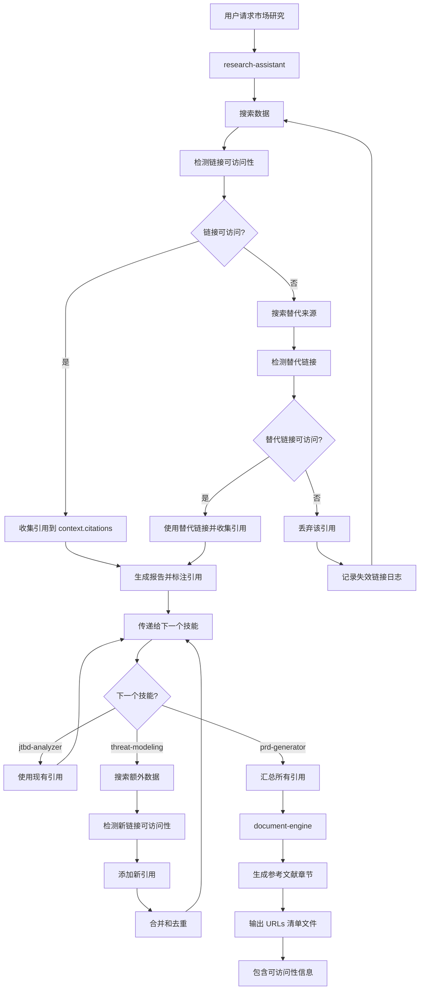
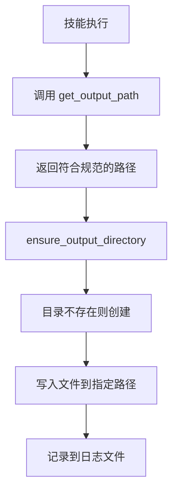

# Skills Shared Components

> **版本**: 1.0.0
> **最后更新**: 2025-01-22
> **目的**: 为所有技能提供共享的配置、规范和组件

---

## 📁 目录结构

```
skills/shared/
├── README.md                 # 本文档 - 共享组件总览
├── citation-manager.md       # 引用管理系统 - 统一的引用格式和追踪机制
├── output-paths.yaml         # 输出路径配置 - 统一的输出目录和文件命名规范
└── (未来可能添加的组件)
    ├── search-strategies.yaml # 搜索策略配置
    ├── scoring-models.yaml    # 评分模型定义
    └── common-sections.yaml   # 通用章节模板
```

---

## 🎯 核心组件

### 1. Citation Manager (引用管理系统)

**文件**: `citation-manager.md`

**用途**:
- 为所有需要搜索数据的技能提供统一的引用管理机制
- 确保所有搜索到的链接都被正确记录和引用
- 支持跨技能的引用共享和去重
- **强制执行链接可访问性检测，确保不出现 404、403、500 等错误**

**核心功能**:
1. **引用格式标准**
   - 统一的引用编号格式: `[来源缩写 年份]序号`
   - 数据点标注格式: `$42.5 亿 [Gartner 2024]¹`
   - 参考文献章节格式

2. **引用收集流程**
   - 搜索时自动收集引用信息
   - 数据点标注
   - 生成参考文献章节

3. **跨技能引用共享**
   - 引用上下文传递
   - 引用去重
   - 引用汇总

4. **链接可访问性检测（强制执行）**
   - 每个链接必须使用 `mcp__fetch__fetch` 检测
   - 记录 HTTP 状态码、响应时间、检测时间
   - 404/403/500 等错误链接必须丢弃，搜索替代来源
   - 需要注册的链接必须提供可访问的备用链接
   - 在 URLs 清单中包含可访问性信息

5. **引用验证和质量标注**
   - 验证状态分类（已验证可访问、未验证、链接失效等）
   - 数据质量标注（可靠性、时效性、完整性）

**使用此组件的技能**:
- `research-assistant`: 主要引用收集者
- `jtbd-analyzer`: 使用和扩展引用
- `threat-modeling`: 可能需要行业威胁数据引用
- `forecast-engine`: 使用市场数据引用
- `analytics-engine`: 使用数据引用
- `prd-generator`: 汇总所有引用
- `document-engine`: 格式化引用章节

---

### 2. Output Paths Configuration (输出路径配置)

**文件**: `output-paths.yaml`

**用途**:
- 为所有技能和命令提供统一的输出路径规范
- 确保所有报告保存到正确的 `outputs/` 子目录
- 统一的文件命名格式

**目录结构**:
```
outputs/
├── market-research/       # 市场研究报告
├── jtbd/                  # JTBD 分析报告
├── threat-models/         # 威胁建模报告
├── compliance/            # 合规检查报告
├── forecasts/             # 增长预测报告
├── analytics/             # 数据分析报告
├── prds/                  # PRD 文档
├── impact/                # 影响分析报告
├── use-cases/             # 用例文档
├── logs/                  # 执行日志
└── references/            # 参考文献 URLs
```

**核心功能**:
1. **技能输出路径映射**: 定义每个技能的输出目录和文件命名
2. **命令输出路径映射**: 定义每个命令的输出文件集合
3. **日志文件规范**: 统一的日志文件命名和内容格式
4. **参考文献 URLs 文件规范**: URLs 清单文件的格式

**文件命名格式**:
- 主报告: `YYYY-MM-DD-[topic]-type.md`
- 日志文件: `YYYY-MMDD-[skill]-[context].log`
- URLs清单: `YYYY-MMDD-[topic]-urls.md`

---

## 🔄 组件协作流程

### 引用管理流程（包含链接检测）



### 输出路径使用流程



---

## 📋 使用指南

### 对于技能开发者

#### 添加引用收集

如果你的技能需要使用搜索引擎:

1. **在技能文件中引用 `citation-manager.md`**:
   ```yaml
   引用管理: 使用 skills/shared/citation-manager.md 中的引用格式标准
   ```

2. **搜索时收集引用**:
   ```yaml
   context.citations:
     - id: 1
       source: "Gartner"
       year: 2024
       title: "完整标题"
       url: "https://..."
       # ... 完整引用信息
   ```

3. **在数据点后标注引用**:
   ```markdown
   市场规模 $42.5 亿 [Gartner 2024]¹
   ```

4. **传递给下一个技能**:
   ```yaml
   输出上下文包含 citations 和 citation_counter
   ```

#### 定义输出路径

1. **在 `output-paths.yaml` 中添加配置**:
   ```yaml
   your-skill:
     输出目录: outputs/your-dir/
     文件命名: YYYY-MM-DD-[topic]-your-type.md
   ```

2. **在技能文件中引用**:
   ```yaml
   输出路径（遵循 skills/shared/output-paths.yaml）:
     - 主报告: outputs/your-dir/YYYY-MM-DD-[topic]-your-type.md
     - 日志文件: outputs/logs/YYYY-MMDD-your-skill-[topic].log
   ```

3. **使用路径函数**:
   ```python
   output_path = get_output_path('your-skill', context, 'main')
   ensure_output_directory(output_path)
   ```

### 对于命令开发者

1. **明确指定所有输出文件**:
   ```yaml
   ## 输出
   outputs/
   ├── dir1/
   │   └── file1.md
   ├── dir2/
   │   └── file2.md
   └── references/
       └── urls.md
   ```

2. **说明参考文献处理**:
   ```yaml
   参考文献:
   - 所有搜索到的链接汇总到 outputs/references/
   - 每个子报告包含参考文献章节
   - 主文档汇总所有引用
   ```

---

## ✅ 检查清单

### 技能发布前检查

- [ ] 是否需要使用搜索引擎?
  - [ ] 是: 是否添加了引用收集?
  - [ ] 是: 是否在数据点后标注引用?
  - [ ] 是: 是否生成参考文献章节?
  - [ ] 是: 是否生成 URLs 清单文件?
  - [ ] **是: 是否对每个链接进行可访问性检测?**
  - [ ] **是: 是否记录 HTTP 状态码和响应时间?**
  - [ ] **是: 是否处理失效链接（404/403/500）?**
  - [ ] **是: 是否为需要注册的链接提供备用链接?**
  - [ ] **是: 是否在 URLs 清单中包含可访问性信息?**

- [ ] 是否定义了输出路径?
  - [ ] 是: 是否在 `output-paths.yaml` 中添加配置?
  - [ ] 是: 是否在技能文件中引用配置?
  - [ ] 是: 是否使用路径函数确保目录存在?

- [ ] 是否需要传递引用给下一个技能?
  - [ ] 是: 是否在输出上下文中包含 `citations`?
  - [ ] 是: 是否在输出上下文中包含 `citation_counter`?
  - [ ] **是: 是否包含 `url_check` 字段?**

---

## 🐛 已知问题和修复

### 问题 1: 输出路径不统一

**症状**:
- 技能输出到不同的目录
- 文件命名格式不一致
- 难以找到生成的报告

**修复**:
- 创建 `output-paths.yaml` 统一配置
- 所有技能遵循配置中的路径规范
- 使用路径函数自动生成正确路径

### 问题 2: 引用链接缺失

**症状**:
- 报告中没有参考文献章节
- 数据点没有引用标注
- 搜索到的链接没有保存

**修复**:
- 创建 `citation-manager.md` 统一引用管理
- 技能搜索时自动收集引用
- `document-engine` 自动添加参考文献章节
- 生成独立的 URLs 清单文件

### 问题 3: 链接失效（404/403/500）

**症状**:
- 报告中的链接无法访问
- 出现 "Page Not Found" 错误
- 影响报告的可信度

**修复**:
- **强制执行链接可访问性检测**
- 每个链接必须使用 `mcp__fetch__fetch` 检测
- 记录 HTTP 状态码、响应时间、检测时间
- 404/403/500 等错误链接必须丢弃，搜索替代来源
- 需要注册的链接必须提供可访问的备用链接
- 在 URLs 清单中包含可访问性信息
- 最终报告只使用"已验证可访问"的引用

---

## 📚 相关文档

### 技能文档

- `research-assistant/SKILL.md`: 引用收集的主要实现
- `jtbd-analyzer/SKILL.md`: 使用引用的示例
- `threat-modeling/SKILL.md`: 引用扩展的示例
- `document-engine/SKILL.md`: 自动生成参考文献章节

### 命令文档

- `PM-Full-Analysis.md`: 完整工作流的输出规范
- `PM-Market-Research.md`: 单一命令的输出规范

### 根文档

- `CLAUDE.md`: 项目整体文档
- `../templates/config.yaml`: 模板配置（可能包含相关配置）

---

## 🔄 版本历史

| 版本 | 日期 | 变更 | 作者 |
|------|------|------|------|
| 1.0.0 | 2025-01-22 | 初始版本 - 创建引用管理和输出路径配置 | AI Architect |

---

## 📮 反馈和贡献

如果你发现任何问题或有改进建议，请：

1. **报告问题**: 在项目仓库提交 Issue
2. **提出改进**: 提交 Pull Request
3. **讨论设计**: 在项目讨论区发起讨论

---

*此共享组件系统是 Oh-My-PM-Skills 项目的一部分*
*版本: 1.0.0 | 最后更新: 2025-01-22*
